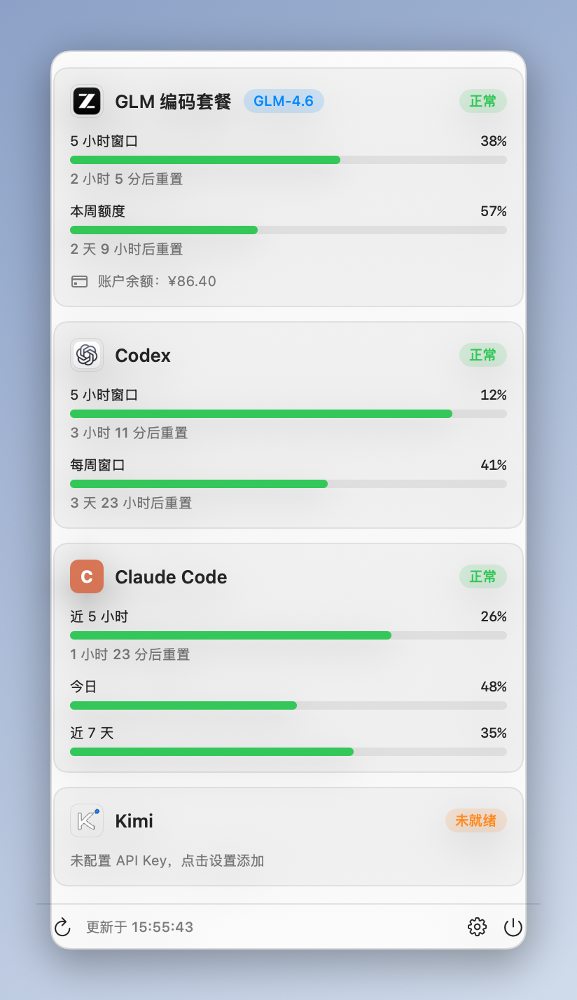
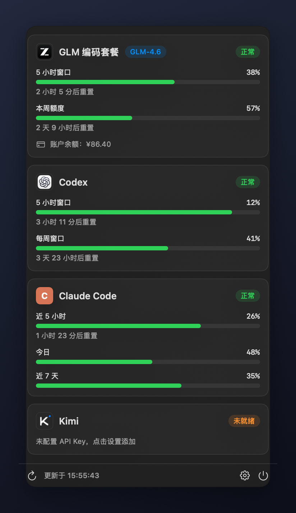

# AgentMeter

macOS 菜单栏 Code Agent 用量监控。轻量原生 Swift 实现，零第三方依赖。

  

| 浅色模式 | 深色模式 |
|---|---|
|  |  |

> 截图为演示数据。

## 功能

- **菜单栏常驻**：点击仪表盘图标展开用量面板，不占 Dock（`LSUIElement`）
- **GLM 编码套餐**（智谱国内站）：5 小时窗口 / 本周额度进度条、重置倒计时、套餐档位、账户余额
- **Codex**：本地解析 `~/.codex/sessions` 会话快照，零配置、零网络
- **Claude Code**：本地解析 `~/.claude/projects` 会话，聚合近 5 小时 / 今日 / 近 7 天 tokens
- **DeepSeek / Kimi（Moonshot）**：API Key 直查账户余额
- **自定义余额接口**：任意「GET + Bearer + JSON 余额字段」接口，endpoint + jsonPath 即可接入
- **用量阈值提醒**：越过阈值发系统通知（默认 80%，可多档）
- **安全**：API Key 仅存 macOS 钥匙串，不上传、不落明文；分发产物过密钥特征门禁扫描
- 单源失败不影响其他源，卡片直接显示错误原因
- 支持自动刷新间隔（5/10/30/60 分钟）、开机自启、深浅色自适应

## 构建

依赖：Xcode Command Line Tools（无需完整 Xcode）。

```bash
./build.sh          # 产物：AgentMeter.app
open AgentMeter.app

./dist.sh           # 进一步产出 universal DMG（tools/sign.sh、tools/check_no_secrets.py 门禁）
```

签名：构建时自动选用钥匙串中的 **AgentMeter Dev** 自签名身份（每台开发机只需执行一次 `./tools/make_cert.sh` 创建，幂等，之后构建自动复用，应用更新不再弹钥匙串授权）；未创建该身份时回退 ad-hoc 签名，不影响功能。直接下载 Release DMG 的用户无需任何签名步骤。

首次运行如被 Gatekeeper 拦截：右键 App → 打开。

## 自动打包

推送代码到 `main` 后，GitHub Actions 自动构建 universal DMG 并更新 [latest 预发布](https://github.com/rye567/agent_meter/releases/tag/latest)；发布正式版本时：修改 `Info.plist` 版本号 → 推送 `v*` 标签（如 `v0.1.1`）→ 自动创建对应 Release。

## 使用

1. 菜单栏点击仪表盘图标展开面板
2. 面板底部齿轮进入设置
3. GLM 数据源填入编码套餐 API Key（形如 `id.secret`）→ 保存 → 测试连接

## 数据来源

| 数据源 | 方式 | 说明 |
|---|---|---|
| GLM 编码套餐 | HTTP | `open.bigmodel.cn/api/monitor/usage/quota/limit`（Authorization 头直传原始 Key，无 Bearer）+ 余额接口 |
| Codex | 本地文件 | `~/.codex/sessions/**/*.jsonl` 中 `token_count` 事件的 `rate_limits` 快照 |
| Claude Code | 本地文件 | `~/.claude/projects/**/*.jsonl` 中 `assistant` 消息的 `usage`，按 `message.id + requestId` 去重 |
| DeepSeek / Kimi | HTTP | 各自开放平台余额接口，Key 存钥匙串 |
| 自定义接口 | HTTP | `endpoint` + `jsonPath`（点路径）描述任意余额接口 |

> 注：GLM 用量接口为官方插件所用非公开接口，字段可能随平台调整。

## 目录结构

```
Sources/
├── AgentMeterApp.swift     # 入口：状态栏图标 + NSPopover 面板 + 设置窗口
├── Models/                 # 数据模型与配置（SettingsStore / CustomProvider…）
├── Services/               # Keychain / GLM / Codex / Claude / DeepSeek / Kimi / 自定义
├── ViewModels/             # 刷新调度与状态中枢
└── Views/                  # 面板 / 卡片 / 设置 / 组件
tools/                      # 签名、证书、资产生成、分发密钥门禁
screenshots/                # README 截图（渲染自真实 UI + 演示数据）
```

标准 Swift 源码布局，拖入 Xcode 工程即可继续开发。

## 安全设计

- API Key 只写 macOS 钥匙串（`KeychainService`），UserDefaults 仅存非敏感配置
- 本地会话解析（Codex / Claude）零网络、零上传
- `tools/check_no_secrets.py`：打包前扫描产物，比对本机已知密钥 + 通用密钥特征（`sk-`、`id.secret`），命中即中止分发

## Roadmap

- [ ] Z.AI 国际站（接口同构，换 host）
- [ ] Claude OAuth 实时配额（5h/7d 官方百分比）
- [ ] 用量趋势图（近 7 天）
- [ ] 菜单栏数字实时百分比模式

## License

MIT
